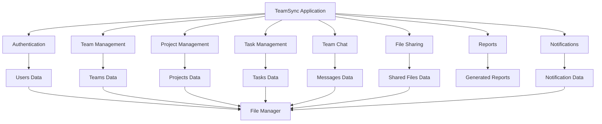
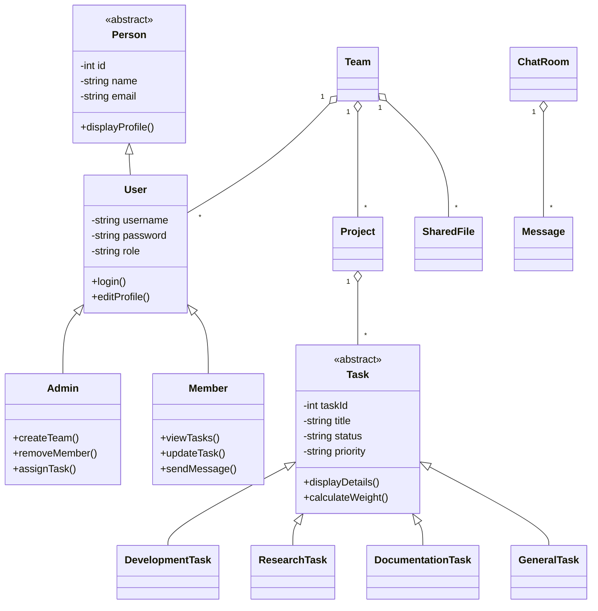
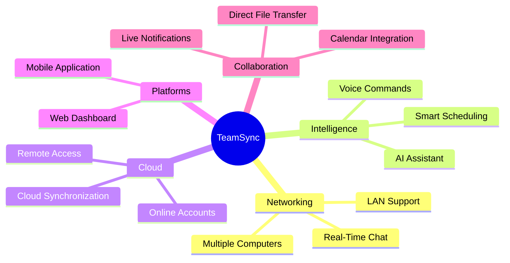

<div align="center">


<br/>

<p>
  
  
  
  
  
</p>

<br/>

> **TeamSync** is a local C++ team collaboration and task management system designed to help groups organize projects, assign responsibilities, communicate, share resources, and monitor progress from one centralized application.

<br/>

[Overview](#-project-overview) •
[Features](#-planned-features) •
[Architecture](#-planned-system-architecture) •
[Roadmap](#-development-roadmap) •
[Team](#-development-team)

</div>

---

## ✨ Project Overview

<table>
<tr>
<td width="55%">

### What is TeamSync?

TeamSync is being developed for:

- Student project groups
- College clubs
- Development teams
- Academic collaborations
- Small organizations
- Local working groups

The platform will allow members to create teams, organize projects, assign tasks, send messages, share file information, track progress, and generate reports.

The first version is designed to run locally on a single computer. The architecture will remain expandable for future LAN networking and real-time collaboration.

</td>

<td width="45%" align="center">

```text
┌─────────────────────────────┐
│          TEAMSYNC           │
├─────────────────────────────┤
│  👥 Teams                   │
│  📁 Projects                │
│  ✅ Tasks                   │
│  💬 Team Chat               │
│  📎 Shared Files            │
│  📊 Progress Reports        │
│  🔔 Notifications           │
└─────────────────────────────┘
```

</td>
</tr>
</table>

---

## 🚧 Current Project Status

TeamSync is currently in the **planning and initial development stage**.

The repository will gradually include:

- C++ source files
- Header files
- Local data storage
- CMake configuration
- Documentation
- Testing records
- Screenshots
- Sample project data

> Features listed below represent the planned Phase 1 scope and may change during development.

---

## 🚀 Planned Features

<table>
<tr>
<td width="50%">

### 👤 User Management

- Register new accounts
- Log in and log out
- View user profiles
- Edit profile information
- Change passwords
- Admin and Team Member roles
- Store user skills

</td>

<td width="50%">

### 👥 Team Management

- Create teams
- Join using a team ID or code
- View team members
- Assign team roles
- Remove members with permission
- Leave teams
- Search team records

</td>
</tr>

<tr>
<td width="50%">

### 📁 Project Management

- Create projects
- Add projects to teams
- Set project deadlines
- Update project status
- View project progress
- Edit project information
- Archive completed projects

</td>

<td width="50%">

### ✅ Task Management

- Create tasks
- Assign tasks to members
- Set priorities
- Set due dates
- Track progress
- Mark tasks complete
- Reopen completed tasks
- Search, sort, and filter tasks

</td>
</tr>

<tr>
<td width="50%">

### 💬 Local Team Chat

- Send team messages
- Store message history
- Display sender and timestamp
- Search previous messages
- Delete owned messages
- Refresh team conversations

</td>

<td width="50%">

### 📎 File Sharing

- Share file names and paths
- Add file descriptions
- Store uploader information
- Check file availability
- Open valid local files
- Detect missing files
- Search shared-file records

</td>
</tr>

<tr>
<td width="50%">

### 📊 Dashboard

- Pending task count
- Completed task count
- Overdue task count
- Joined team count
- Active project overview
- Recent messages
- Team activity summary

</td>

<td width="50%">

### 📑 Reports

- Task completion reports
- Pending task reports
- Overdue task reports
- Team activity reports
- Project progress reports
- Contribution reports
- Shared-file reports

</td>
</tr>
</table>

---

## 🧠 Workload-Based Task Recommendation

TeamSync is planned to include a rule-based member recommendation feature.

The recommendation score may consider:

```text
Skill Match
     +
Current Workload
     +
Active Tasks
     +
Completed Tasks
     +
Task Priority
     +
Completion Rate
     =
Recommendation Score
```

Example planned output:

```text
╔════════════════════════════════════════╗
║       MEMBER RECOMMENDATION            ║
╠════════════════════════════════════════╣
║ Task: Design Login Interface           ║
║ Required Skill: UI Design              ║
║ Priority: High                         ║
║                                        ║
║ Recommended Member: Member 2           ║
║ Skill Match: 90%                       ║
║ Active Tasks: 2                        ║
║ Recommendation Score: 84/100           ║
╚════════════════════════════════════════╝
```

> This will be an explainable rule-based feature and will not be presented as artificial intelligence.

---

## 📊 Planned Contribution Tracking

TeamSync may estimate member contribution using:

- Tasks assigned
- Tasks completed
- Tasks completed before deadlines
- Overdue tasks
- Team activity
- Project participation
- Messages and shared-file activity

Example:

```text
Member              Completed      On-Time      Contribution
────────────────────────────────────────────────────────────
Member 1                12           91%              88
Member 2                 9           84%              79
Member 3                 7           70%              65
```

> Contribution scores will only be estimates and should not be treated as a perfect measurement of a member’s work.

---

## 🏗️ Planned System Architecture



---

## 🧬 Planned OOP Class Structure



---

## 🎓 OOP Concepts

<p align="center">
  
  
  
  
  
</p>

<p align="center">
  
  
  
  
  
</p>

TeamSync is planned to demonstrate:

- Classes and objects
- Encapsulation
- Abstraction
- Inheritance
- Runtime polymorphism
- Virtual functions
- Pure virtual functions
- Constructors and destructors
- Function overloading
- Operator overloading
- Static members
- Friend functions
- Arrays and pointers
- Dynamic memory
- File handling
- STL containers and algorithms

---

## 🛠️ Planned Technologies

<div align="center">

| Technology | Purpose |
|---|---|
| C++17 | Main programming language |
| CMake | Project building and configuration |
| STL | Containers and algorithms |
| `fstream` | Local data storage |
| `filesystem` | Local shared-file handling |
| `vector` | Dynamic record collections |
| `map` | ID-based record lookup |
| `queue` | Notification handling |
| `algorithm` | Searching and sorting |

</div>

---

## 📂 Planned Project Structure

```text
TeamSync/
│
├── CMakeLists.txt
├── README.md
│
├── data/
│   ├── users.dat
│   ├── teams.dat
│   ├── projects.dat
│   ├── tasks.dat
│   ├── messages.dat
│   ├── shared_files.dat
│   ├── notifications.dat
│   └── activity_logs.dat
│
├── reports/
│
├── docs/
│   ├── architecture.md
│   ├── class_diagram.md
│   ├── testing.md
│   └── viva_notes.md
│
├── include/
│   ├── Person.h
│   ├── User.h
│   ├── Admin.h
│   ├── Member.h
│   ├── Team.h
│   ├── Project.h
│   ├── Task.h
│   ├── Message.h
│   ├── ChatRoom.h
│   ├── SharedFile.h
│   ├── Notification.h
│   ├── ActivityLog.h
│   ├── Authentication.h
│   ├── FileManager.h
│   ├── ReportGenerator.h
│   ├── Dashboard.h
│   ├── Date.h
│   └── TeamSyncApplication.h
│
└── src/
    ├── main.cpp
    ├── Person.cpp
    ├── User.cpp
    ├── Admin.cpp
    ├── Member.cpp
    ├── Team.cpp
    ├── Project.cpp
    ├── Task.cpp
    ├── Message.cpp
    ├── ChatRoom.cpp
    ├── SharedFile.cpp
    ├── Notification.cpp
    ├── ActivityLog.cpp
    ├── Authentication.cpp
    ├── FileManager.cpp
    ├── ReportGenerator.cpp
    ├── Dashboard.cpp
    ├── Date.cpp
    └── TeamSyncApplication.cpp
```

---

## ⚙️ Installation

Installation instructions will be added after the first functional version is completed.

The repository will eventually support:

```bash
git clone https://github.com/SudhanTheDev/TeamSync.git
cd TeamSync
mkdir build
cd build
cmake ..
cmake --build .
```

> These commands may not work until the source files and CMake configuration are added.

---

## 🧭 Planned Workflow


---

## 🔐 User Roles

<table>
<tr>
<td width="50%">

### 👑 Admin

- Create teams
- Manage members
- Create projects
- Assign tasks
- Edit team details
- Remove team members
- View reports
- Monitor activity

</td>

<td width="50%">

### 👤 Team Member

- Join teams
- View assigned tasks
- Update progress
- Complete tasks
- Send messages
- Share files
- View notifications
- View permitted reports

</td>
</tr>
</table>

---

## 🗺️ Development Roadmap

### ✅ Phase 1 — Foundation

✅ Define project requirements  
✅ Prepare the project proposal  
✅ Create the GitHub repository  
✅ Design the initial README  
✅ Plan the class structure  
✅ Plan the application modules  

### ✅ Phase 2 — User System

✅ Design registration workflow  
✅ Design login workflow  
✅ Define Admin and Member roles  
✅ Plan user-profile management  
✅ Plan local user storage  

### ✅ Phase 3 — Teams and Projects

✅ Define team creation workflow  
✅ Define team joining workflow  
✅ Plan team-member controls  
✅ Plan project creation  
✅ Plan project status tracking  

### ✅ Phase 4 — Task System

✅ Define task structure  
✅ Define task priorities  
✅ Define task statuses  
✅ Plan task assignment  
✅ Plan task completion tracking  
✅ Plan workload recommendation  

### ✅ Phase 5 — Collaboration

✅ Plan local team chat  
✅ Plan message-history storage  
✅ Plan shared-file records  
✅ Plan notifications  
✅ Plan activity logging  

### ✅ Phase 6 — Reports

✅ Plan dashboard statistics  
✅ Plan team activity reports  
✅ Plan contribution reports  
✅ Plan project progress reports  
✅ Plan exportable reports  

### ✅ Phase 7 — Implementation and Testing

✅ Begin C++ implementation  
✅ Compile each project module  
✅ Test registration and login  
✅ Test teams and projects  
✅ Test task assignment  
✅ Test file storage  
✅ Test reports  
✅ Fix errors and finalize documentation  

> The check marks above represent the planned development roadmap. Update each line as the actual implementation progresses.

---

## 🔮 Future Scope



Future features may include:

- LAN networking
- Multiple-computer support
- Real-time messaging
- Real-time notifications
- Direct file transfer
- Cloud synchronization
- Mobile application
- Calendar integration
- AI-assisted task suggestions
- Voice commands

---

## 📸 Screenshots

<div align="center">

> Screenshots will be added after development begins.

| Login | Dashboard |
|---|---|
| Coming Soon | Coming Soon |

| Tasks | Team Chat |
|---|---|
| Coming Soon | Coming Soon |

</div>

---

## 👨‍💻 Development Team

<table align="center">
<tr>
<td align="center" width="50%">

### Sudhan Bhattarai

**Developer**

[](https://github.com/SudhanTheDev)

</td>

<td align="center" width="50%">

### Severoos Nepali

**Developer**

[](https://github.com/FRIEND-USERNAME)

</td>
</tr>
</table>

---

## 🎓 Academic Information

<div align="center">

| Field | Details |
|---|---|
| Project | TeamSync |
| Subject | Object-Oriented Programming |
| Semester | Second Semester |
| Instructor | Ojan Adhikari |
| Developers | Sudhan Bhattarai & Severoos Nepali |
| Language | C++ |
| Reference & Supporter | Senior Sudip Khanal |

</div>

---

## 🤝 Contributing

Suggestions and improvements are welcome through GitHub issues and pull requests.

```bash
git checkout -b feature/your-feature
git commit -m "Add your feature"
git push origin feature/your-feature
```

---

## ⭐ Support

<div align="center">

If you find this project interesting, consider giving the repository a star.

<br/><br/>


</div>

---

<div align="center">


### TeamSync

**Organize. Collaborate. Complete.**

Built with C++ and Object-Oriented Programming.

</div>
