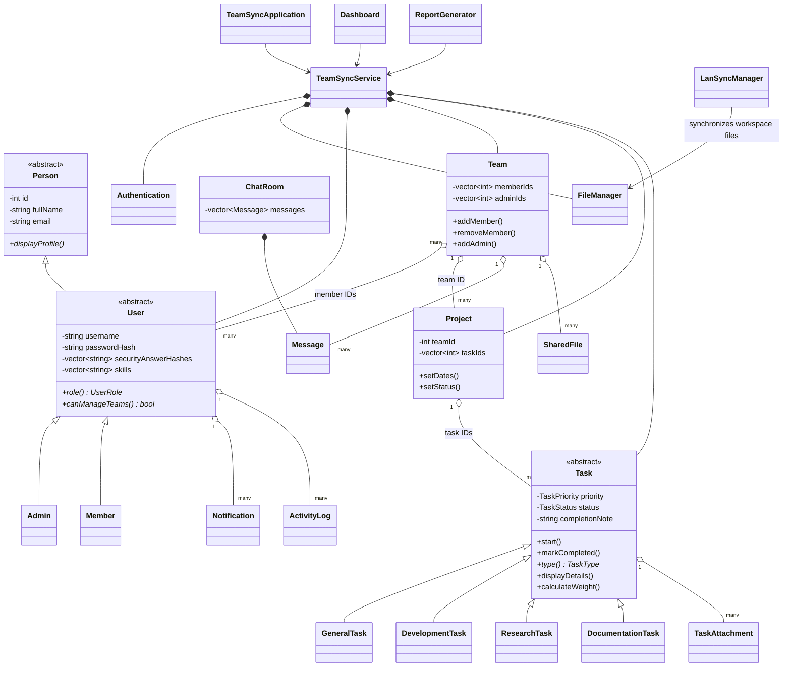

# Class Diagram

An open diamond means aggregation by stable IDs; a filled diamond means direct object ownership. This avoids unsafe owning pointers between records while still expressing the real domain relationships.
